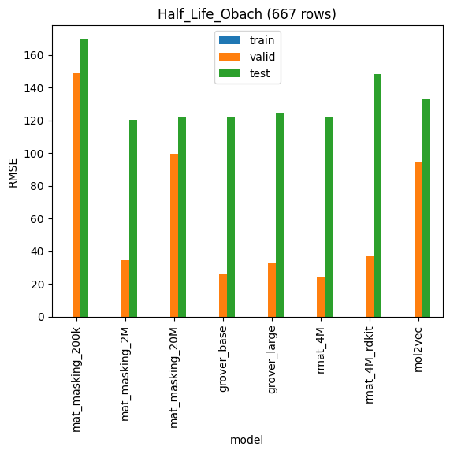
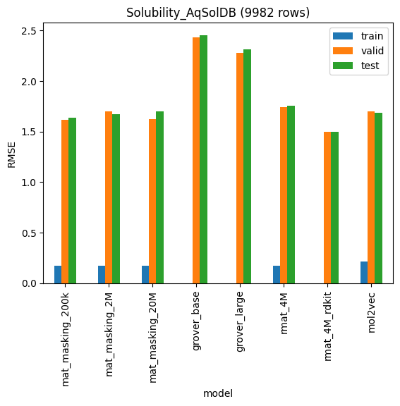
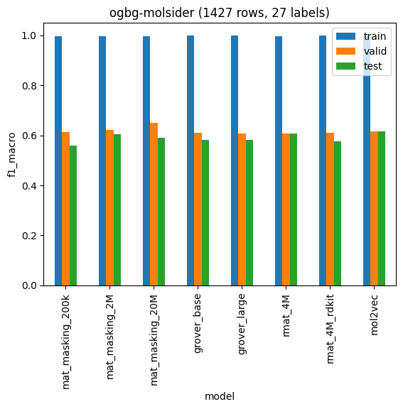
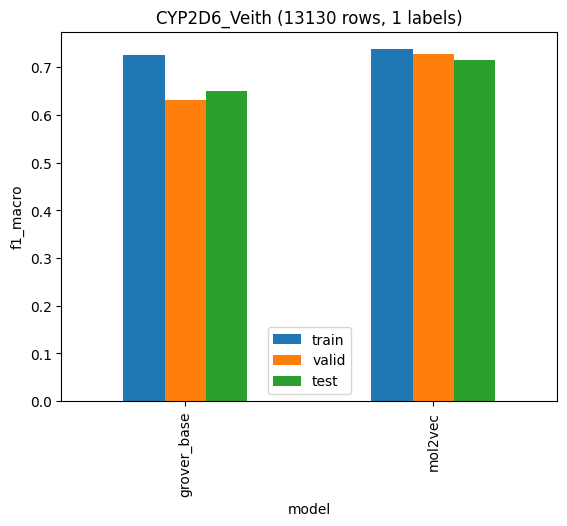
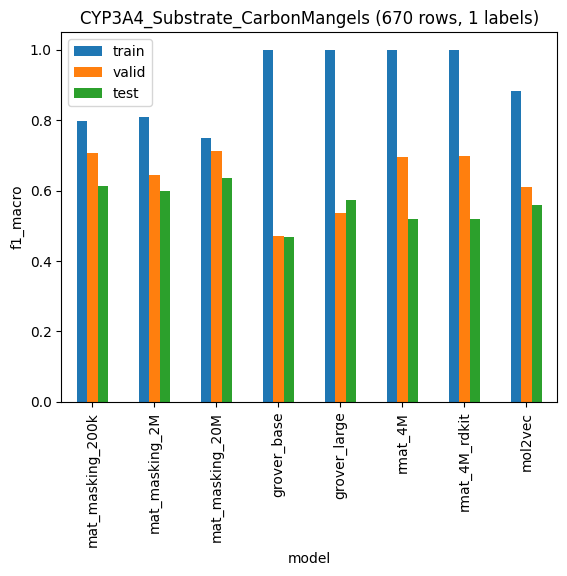

# Regression

## ogbg-molesol (1128 rows)

### Decision Tree regression

|                  |       train |   valid |    test |   rows |
|:-----------------|------------:|--------:|--------:|-------:|
| mat_masking_200k | 5.13221e-17 | 1.54632 | 1.48653 |   1128 |
| mat_masking_2M   | 7.84175e-18 | 1.45785 | 1.45768 |   1128 |
| mat_masking_20M  | 5.17199e-17 | 1.52486 | 1.51343 |   1128 |
| grover_base      | 3.20138e-18 | 2.21299 | 2.37327 |   1128 |
| grover_large     | 0           | 2.54032 | 2.00635 |   1128 |
| rmat_4M          | 0           | 1.65464 | 1.62287 |   1128 |
| rmat_4M_rdkit    | 3.20138e-18 | 1.22993 | 1.25156 |   1128 |
| mol2vec          | 0.0242687   | 1.84623 | 1.88578 |   1128 |

### Linear regression

|                  |       train |     valid |      test |   rows |
|:-----------------|------------:|----------:|----------:|-------:|
| mat_masking_200k | 0.00698101  |  12.0835  |  16.3164  |   1128 |
| mat_masking_2M   | 0.00669632  |  10.6559  |  10.608   |   1128 |
| mat_masking_20M  | 0.0110913   |  11.0957  |  11.6254  |   1128 |
| grover_base      | 4.84409e-05 |   2.16324 |   2.08121 |   1128 |
| grover_large     | 2.9522e-05  |   1.9734  |   1.93066 |   1128 |
| rmat_4M          | 0.000379213 | 273.401   | 332.63    |   1128 |
| rmat_4M_rdkit    | 0.00145986  |   1.6469  |   1.66789 |   1128 |
| mol2vec          | 0.498069    |   2.15405 |   2.2177  |   1128 |

## ogbg-molfreesolv (642 rows)

### Decision Tree regression

|                  |     train |   valid |    test |   rows |
|:-----------------|----------:|--------:|--------:|-------:|
| mat_masking_200k | 0         | 4.56609 | 3.50316 |    642 |
| mat_masking_2M   | 0         | 5.17103 | 4.19943 |    642 |
| mat_masking_20M  | 0         | 4.17068 | 3.38089 |    642 |
| grover_base      | 0         | 5.42548 | 4.63254 |    642 |
| grover_large     | 0         | 5.52991 | 4.47601 |    642 |
| rmat_4M          | 0         | 4.85024 | 4.28943 |    642 |
| rmat_4M_rdkit    | 0         | 3.92973 | 2.92358 |    642 |
| mol2vec          | 0.0159983 | 6.42834 | 5.4461  |    642 |

### Linear regression

|                  |       train |      valid |       test |   rows |
|:-----------------|------------:|-----------:|-----------:|-------:|
| mat_masking_200k | 0.00221332  |   10.1227  |   10.9091  |    642 |
| mat_masking_2M   | 0.00136263  |    7.71911 |   11.7169  |    642 |
| mat_masking_20M  | 0.00130776  |    5.61877 |    8.7636  |    642 |
| grover_base      | 2.89642e-05 |    5.01787 |    4.14707 |    642 |
| grover_large     | 1.55214e-05 |    4.14497 |    3.55923 |    642 |
| rmat_4M          | 1.53808e-05 |    3.43338 |    2.67121 |    642 |
| rmat_4M_rdkit    | 1.09142e-05 |    3.79793 |    2.9608  |    642 |
| mol2vec          | 0.33686     | 2735.08    | 4921.13    |    642 |

## ogbg-mollipo (4200 rows)

### Decision Tree regression

|                  |       train |   valid |    test |   rows |
|:-----------------|------------:|--------:|--------:|-------:|
| mat_masking_200k | 2.39223e-17 | 1.31769 | 1.26591 |   4200 |
| mat_masking_2M   | 2.98568e-17 | 1.35078 | 1.2943  |   4200 |
| mat_masking_20M  | 2.73562e-17 | 1.32591 | 1.20573 |   4200 |
| grover_base      | 1.32697e-17 | 1.656   | 1.61262 |   4200 |
| grover_large     | 1.87662e-17 | 1.60446 | 1.59386 |   4200 |
| rmat_4M          | 1.99218e-17 | 1.34156 | 1.29984 |   4200 |
| rmat_4M_rdkit    | 3.52647e-17 | 1.20541 | 1.11601 |   4200 |
| mol2vec          | 0.0251507   | 1.39515 | 1.32412 |   4200 |

### Linear regression

|                  |     train |    valid |     test |   rows |
|:-----------------|----------:|---------:|---------:|-------:|
| mat_masking_200k | 0.459235  | 0.8869   | 0.922497 |   4200 |
| mat_masking_2M   | 0.459562  | 0.852463 | 0.860197 |   4200 |
| mat_masking_20M  | 0.458266  | 1.06974  | 0.911371 |   4200 |
| grover_base      | 0.61604   | 1.25516  | 1.3509   |   4200 |
| grover_large     | 0.425739  | 1.74478  | 1.66922  |   4200 |
| rmat_4M          | 0.111604  | 2.35853  | 2.3288   |   4200 |
| rmat_4M_rdkit    | 0.0637007 | 4.20537  | 3.92791  |   4200 |
| mol2vec          | 0.703022  | 0.863039 | 0.917748 |   4200 |

## Caco2_Wang (910 rows)

### Decision Tree regression

|                  |       train |    valid |     test |   rows |
|:-----------------|------------:|---------:|---------:|-------:|
| mat_masking_200k | 1.40764e-16 | 0.778543 | 0.634143 |    910 |
| mat_masking_2M   | 0           | 0.638098 | 0.706476 |    910 |
| mat_masking_20M  | 0           | 0.657553 | 0.603511 |    910 |
| grover_base      | 0           | 0.837257 | 0.909947 |    910 |
| grover_large     | 9.31064e-17 | 0.857676 | 1.04117  |    910 |
| rmat_4M          | 0           | 0.600366 | 0.603583 |    910 |
| rmat_4M_rdkit    | 0           | 0.671389 | 0.65066  |    910 |
| mol2vec          | 0.0371996   | 0.65532  | 0.699054 |    910 |

### Linear regression

|                  |       train |    valid |     test |   rows |
|:-----------------|------------:|---------:|---------:|-------:|
| mat_masking_200k | 0.00324107  | 3.16599  | 3.44182  |    910 |
| mat_masking_2M   | 0.00203481  | 5.94491  | 4.91463  |    910 |
| mat_masking_20M  | 0.00216826  | 5.2437   | 5.76903  |    910 |
| grover_base      | 1.66112e-05 | 1.03189  | 1.143    |    910 |
| grover_large     | 3.65524e-06 | 0.822036 | 0.853789 |    910 |
| rmat_4M          | 3.4816e-06  | 0.736399 | 0.785425 |    910 |
| rmat_4M_rdkit    | 6.89645e-06 | 0.716403 | 0.684592 |    910 |
| mol2vec          | 0.24222     | 0.497025 | 0.598275 |    910 |

## Half_Life_Obach (667 rows)

### Decision Tree regression

|                  |       train |    valid |    test |   rows |
|:-----------------|------------:|---------:|--------:|-------:|
| mat_masking_200k | 1.77968e-17 | 149.224  | 169.521 |    667 |
| mat_masking_2M   | 0           |  34.8042 | 120.443 |    667 |
| mat_masking_20M  | 0           |  99.0467 | 121.725 |    667 |
| grover_base      | 0           |  26.6546 | 121.8   |    667 |
| grover_large     | 7.95898e-17 |  32.6067 | 124.767 |    667 |
| rmat_4M          | 3.40783e-17 |  24.3811 | 122.112 |    667 |
| rmat_4M_rdkit    | 0           |  36.8771 | 148.083 |    667 |
| mol2vec          | 0.130884    |  94.6479 | 132.754 |    667 |

### Linear regression

|                  |        train |    valid |    test |   rows |
|:-----------------|-------------:|---------:|--------:|-------:|
| mat_masking_200k |  0.0175462   |  87.829  | 127.672 |    667 |
| mat_masking_2M   |  0.0134639   |  99.3079 | 136.957 |    667 |
| mat_masking_20M  |  0.00750109  | 133.585  | 120.51  |    667 |
| grover_base      |  0.000186672 | 115.916  | 159.655 |    667 |
| grover_large     |  0.000728226 |  78.2146 | 142.407 |    667 |
| rmat_4M          |  0.000382797 |  56.802  | 117.74  |    667 |
| rmat_4M_rdkit    |  0.000309032 |  61.9382 | 121.16  |    667 |
| mol2vec          | 26.0763      |  76.3669 | 115.743 |    667 |

## Lipophilicity_AstraZeneca (4200 rows)

### Decision Tree regression

|                  |       train |   valid |    test |   rows |
|:-----------------|------------:|--------:|--------:|-------:|
| mat_masking_200k | 2.24299e-17 | 1.3383  | 1.22384 |   4200 |
| mat_masking_2M   | 1.46225e-17 | 1.20595 | 1.17439 |   4200 |
| mat_masking_20M  | 2.45707e-17 | 1.13195 | 1.22502 |   4200 |
| grover_base      | 0           | 1.68001 | 1.60974 |   4200 |
| grover_large     | 0           | 1.7011  | 1.66261 |   4200 |
| rmat_4M          | 2.12789e-17 | 1.28292 | 1.28423 |   4200 |
| rmat_4M_rdkit    | 3.54648e-17 | 1.01499 | 1.05963 |   4200 |
| mol2vec          | 0.014182    | 1.2992  | 1.24199 |   4200 |

### Linear regression

|                  |      train |    valid |     test |   rows |
|:-----------------|-----------:|---------:|---------:|-------:|
| mat_masking_200k | 0.463575   | 0.790448 | 0.804873 |   4200 |
| mat_masking_2M   | 0.462312   | 0.730967 | 0.791404 |   4200 |
| mat_masking_20M  | 0.457273   | 0.775786 | 0.834242 |   4200 |
| grover_base      | 0.578362   | 1.23107  | 1.33247  |   4200 |
| grover_large     | 0.717545   | 2.38503  | 2.38137  |   4200 |
| rmat_4M          | 0.00476605 | 4.47002  | 5.10868  |   4200 |
| rmat_4M_rdkit    | 0.00314055 | 3.91511  | 3.9027   |   4200 |
| mol2vec          | 0.710925   | 0.772853 | 0.841598 |   4200 |

## Solubility_AqSolDB (9982 rows)

### Decision Tree regression

|                  |    train |   valid |    test |   rows |
|:-----------------|---------:|--------:|--------:|-------:|
| mat_masking_200k | 0.176647 | 1.61619 | 1.63458 |   9982 |
| mat_masking_2M   | 0.176647 | 1.70113 | 1.67364 |   9982 |
| mat_masking_20M  | 0.176647 | 1.62407 | 1.70126 |   9982 |
| grover_base      | 0        | 2.43347 | 2.45406 |   9982 |
| grover_large     | 0        | 2.27657 | 2.31075 |   9982 |
| rmat_4M          | 0.176647 | 1.7416  | 1.75658 |   9982 |
| rmat_4M_rdkit    | 0        | 1.49934 | 1.4957  |   9982 |
| mol2vec          | 0.21672  | 1.70132 | 1.68724 |   9982 |

### Linear regression

|                  |    train |   valid |    test |   rows |
|:-----------------|---------:|--------:|--------:|-------:|
| mat_masking_200k | 0.929414 | 1.16333 | 1.12537 |   9982 |
| mat_masking_2M   | 0.927466 | 1.19943 | 1.14905 |   9982 |
| mat_masking_20M  | 0.900469 | 1.38399 | 1.18259 |   9982 |
| grover_base      | 1.18991  | 1.61112 | 1.60866 |   9982 |
| grover_large     | 1.05956  | 1.70307 | 1.71578 |   9982 |
| rmat_4M          | 0.654357 | 1.49029 | 1.37921 |   9982 |
| rmat_4M_rdkit    | 0.635467 | 1.49413 | 1.41375 |   9982 |
| mol2vec          | 1.44228  | 1.65839 | 1.56683 |   9982 |

## HydrationFreeEnergy_FreeSolv (642 rows)

### Decision Tree regression

|                  |     train |   valid |    test |   rows |
|:-----------------|----------:|--------:|--------:|-------:|
| mat_masking_200k | 0         | 3.10277 | 1.9442  |    642 |
| mat_masking_2M   | 0         | 2.55983 | 2.5338  |    642 |
| mat_masking_20M  | 0         | 2.48372 | 2.86425 |    642 |
| grover_base      | 0         | 3.88323 | 3.86093 |    642 |
| grover_large     | 0         | 3.85468 | 3.75305 |    642 |
| rmat_4M          | 0         | 2.7944  | 3.18467 |    642 |
| rmat_4M_rdkit    | 0         | 2.66578 | 2.27463 |    642 |
| mol2vec          | 0.0170294 | 3.6445  | 4.12928 |    642 |

### Linear regression

|                  |       train |      valid |       test |   rows |
|:-----------------|------------:|-----------:|-----------:|-------:|
| mat_masking_200k | 0.00152747  |    4.16683 |    3.0768  |    642 |
| mat_masking_2M   | 0.000776091 |    3.38771 |    2.18884 |    642 |
| mat_masking_20M  | 0.000763723 |    3.1571  |    2.47737 |    642 |
| grover_base      | 1.92782e-05 |    3.09214 |    3.23214 |    642 |
| grover_large     | 1.00703e-05 |    3.09132 |    3.02298 |    642 |
| rmat_4M          | 8.21e-06    |    1.15582 |    1.21309 |    642 |
| rmat_4M_rdkit    | 9.39047e-06 |    1.18304 |    1.32111 |    642 |
| mol2vec          | 0.341552    | 2549.26    | 2229.51    |    642 |

## PPBR_AZ (1614 rows)

### Decision Tree regression

|                  |      train |   valid |    test |   rows |
|:-----------------|-----------:|--------:|--------:|-------:|
| mat_masking_200k | 7.3222e-16 | 17.3974 | 17.359  |   1614 |
| mat_masking_2M   | 0          | 16.713  | 18.7868 |   1614 |
| mat_masking_20M  | 0          | 17.563  | 17.8301 |   1614 |
| grover_base      | 0          | 19.7244 | 19.9645 |   1614 |
| grover_large     | 7.3222e-16 | 23.6813 | 21.3328 |   1614 |
| rmat_4M          | 0          | 18.5556 | 19.8879 |   1614 |
| rmat_4M_rdkit    | 7.3222e-16 | 16.6972 | 20.3042 |   1614 |
| mol2vec          | 0.971083   | 20.3527 | 18.3877 |   1614 |

### Linear regression

|                  |        train |   valid |    test |   rows |
|:-----------------|-------------:|--------:|--------:|-------:|
| mat_masking_200k |  2.81156     | 64.2922 | 58.2916 |   1614 |
| mat_masking_2M   |  2.48244     | 45.3105 | 59.5955 |   1614 |
| mat_masking_20M  |  2.55316     | 46.6928 | 61.1722 |   1614 |
| grover_base      |  0.00122059  | 33.8568 | 33.8315 |   1614 |
| grover_large     |  0.000954165 | 21.6135 | 26.7795 |   1614 |
| rmat_4M          |  0.00112266  | 20.1357 | 22.5002 |   1614 |
| rmat_4M_rdkit    |  0.000400431 | 18.4232 | 21.1971 |   1614 |
| mol2vec          | 10.7652      | 13.4531 | 16.1033 |   1614 |

## VDss_Lombardo (1130 rows)

### Decision Tree regression

|                  |       train |   valid |     test |   rows |
|:-----------------|------------:|--------:|---------:|-------:|
| mat_masking_200k | 1.52886e-17 | 68.5082 |  7.66427 |   1130 |
| mat_masking_2M   | 1.38866e-17 | 66.9861 |  9.42919 |   1130 |
| mat_masking_20M  | 0           | 67.5612 | 11.3786  |   1130 |
| grover_base      | 1.70932e-18 | 67.9017 | 11.6259  |   1130 |
| grover_large     | 4.06899e-18 | 68.0933 | 10.9411  |   1130 |
| rmat_4M          | 3.82215e-18 | 67.9716 |  8.91518 |   1130 |
| rmat_4M_rdkit    | 1.60044e-17 | 67.5756 | 10.3521  |   1130 |
| mol2vec          | 0.21907     | 68.1458 | 12.7196  |   1130 |

### Linear regression

|                  |       train |   valid |     test |   rows |
|:-----------------|------------:|--------:|---------:|-------:|
| mat_masking_200k | 0.00771452  | 69.5233 | 28.0502  |   1130 |
| mat_masking_2M   | 0.00871391  | 69.0686 | 25.3519  |   1130 |
| mat_masking_20M  | 0.00900171  | 70.3631 | 28.4951  |   1130 |
| grover_base      | 0.000149133 | 69.0026 | 13.5229  |   1130 |
| grover_large     | 9.33037e-05 | 68.3825 | 10.7738  |   1130 |
| rmat_4M          | 7.13645e-05 | 66.3349 |  9.1234  |   1130 |
| rmat_4M_rdkit    | 0.000130577 | 66.0041 |  9.06808 |   1130 |
| mol2vec          | 4.50638     | 66.8079 |  8.05579 |   1130 |

## Clearance_Hepatocyte_AZ (1213 rows)

### Decision Tree regression

|                  |   train |   valid |    test |   rows |
|:-----------------|--------:|--------:|--------:|-------:|
| mat_masking_200k |   0     | 61.5095 | 61.588  |   1213 |
| mat_masking_2M   |   0     | 66.8773 | 63.8678 |   1213 |
| mat_masking_20M  |   0     | 63.909  | 63.6849 |   1213 |
| grover_base      |   0     | 73.7521 | 71.4759 |   1213 |
| grover_large     |   0     | 75.6393 | 68.455  |   1213 |
| rmat_4M          |   0     | 74.3336 | 67.3644 |   1213 |
| rmat_4M_rdkit    |   0     | 57.8932 | 61.446  |   1213 |
| mol2vec          |  13.363 | 62.914  | 56.1467 |   1213 |

### Linear regression

|                  |       train |       valid |        test |   rows |
|:-----------------|------------:|------------:|------------:|-------:|
| mat_masking_200k |  2.39345    |   5828.22   |   8045.45   |   1213 |
| mat_masking_2M   |  2.29839    |   9365.55   |   9543.28   |   1213 |
| mat_masking_20M  |  2.45513    |  10647.8    |  23780      |   1213 |
| grover_base      |  0.00071379 |     89.7115 |     79.5442 |   1213 |
| grover_large     |  0.00169099 |     73.103  |     72.7126 |   1213 |
| rmat_4M          |  3.02826    | 135050      | 179092      |   1213 |
| rmat_4M_rdkit    |  2.27082    | 120154      | 144282      |   1213 |
| mol2vec          | 32.7047     |     47.6701 |     51.7439 |   1213 |

# Multi-label classification

## ogbg-molbace (1513 rows, 1 labels)

### Decision Tree classification

|                  |    train |    valid |     test |   rows |
|:-----------------|---------:|---------:|---------:|-------:|
| mat_masking_200k | 1        | 0.486395 | 0.569869 |   1513 |
| mat_masking_2M   | 1        | 0.476018 | 0.666374 |   1513 |
| mat_masking_20M  | 1        | 0.467059 | 0.581676 |   1513 |
| grover_base      | 1        | 0.321025 | 0.51618  |   1513 |
| grover_large     | 1        | 0.348458 | 0.444966 |   1513 |
| rmat_4M          | 1        | 0.462214 | 0.531447 |   1513 |
| rmat_4M_rdkit    | 1        | 0.456182 | 0.590972 |   1513 |
| mol2vec          | 0.993074 | 0.462214 | 0.577778 |   1513 |

### Linear classification

|                  |    train |    valid |     test |   rows |
|:-----------------|---------:|---------:|---------:|-------:|
| mat_masking_200k | 0.831908 | 0.496056 | 0.587394 |   1513 |
| mat_masking_2M   | 0.830118 | 0.491683 | 0.581267 |   1513 |
| mat_masking_20M  | 0.820305 | 0.525157 | 0.598323 |   1513 |
| grover_base      | 0.914895 | 0.422266 | 0.515651 |   1513 |
| grover_large     | 0.962944 | 0.431249 | 0.55814  |   1513 |
| rmat_4M          | 0.974991 | 0.613181 | 0.617703 |   1513 |
| rmat_4M_rdkit    | 0.982734 | 0.533369 | 0.627451 |   1513 |
| mol2vec          | 0.863599 | 0.465514 | 0.55942  |   1513 |

## ogbg-molbbbp (2039 rows, 1 labels)

### Decision Tree classification

|                  |    train |    valid |     test |   rows |
|:-----------------|---------:|---------:|---------:|-------:|
| mat_masking_200k | 1        | 0.759104 | 0.533472 |   2039 |
| mat_masking_2M   | 1        | 0.74352  | 0.547581 |   2039 |
| mat_masking_20M  | 1        | 0.690276 | 0.559771 |   2039 |
| grover_base      | 1        | 0.631636 | 0.467164 |   2039 |
| grover_large     | 1        | 0.614764 | 0.461532 |   2039 |
| rmat_4M          | 1        | 0.821817 | 0.566177 |   2039 |
| rmat_4M_rdkit    | 1        | 0.777869 | 0.621198 |   2039 |
| mol2vec          | 0.998865 | 0.769159 | 0.503268 |   2039 |

### Linear classification

|                  |    train |    valid |     test |   rows |
|:-----------------|---------:|---------:|---------:|-------:|
| mat_masking_200k | 0.862818 | 0.88041  | 0.588837 |   2039 |
| mat_masking_2M   | 0.878793 | 0.880969 | 0.553186 |   2039 |
| mat_masking_20M  | 0.825944 | 0.895733 | 0.518437 |   2039 |
| grover_base      | 0.986187 | 0.676471 | 0.521535 |   2039 |
| grover_large     | 0.997719 | 0.686244 | 0.529508 |   2039 |
| rmat_4M          | 0.993137 | 0.860479 | 0.597386 |   2039 |
| rmat_4M_rdkit    | 0.991955 | 0.850513 | 0.60364  |   2039 |
| mol2vec          | 0.904577 | 0.793622 | 0.535529 |   2039 |

## ogbg-molclintox (1477 rows, 2 labels)

### Decision Tree classification

|                  |    train |    valid |     test |   rows |
|:-----------------|---------:|---------:|---------:|-------:|
| mat_masking_200k | 1        | 0.498575 | 0.499891 |   1477 |
| mat_masking_2M   | 1        | 0.622844 | 0.53022  |   1477 |
| mat_masking_20M  | 1        | 0.527809 | 0.495273 |   1477 |
| grover_base      | 1        | 0.469534 | 0.461818 |   1477 |
| grover_large     | 1        | 0.532424 | 0.507238 |   1477 |
| rmat_4M          | 1        | 0.598212 | 0.461818 |   1477 |
| rmat_4M_rdkit    | 1        | 0.523855 | 0.560967 |   1477 |
| mol2vec          | 0.997155 | 0.514989 | 0.516678 |   1477 |

### Linear classification

|                  |    train |    valid |     test |   rows |
|:-----------------|---------:|---------:|---------:|-------:|
| mat_masking_200k | 0.726896 | 0.715278 | 0.692541 |   1477 |
| mat_masking_2M   | 0.785726 | 0.616349 | 0.733755 |   1477 |
| mat_masking_20M  | 0.690613 | 0.616349 | 0.692541 |   1477 |
| grover_base      | 1        | 0.551994 | 0.530688 |   1477 |
| grover_large     | 1        | 0.626956 | 0.564392 |   1477 |
| rmat_4M          | 0.982909 | 0.739437 | 0.785714 |   1477 |
| rmat_4M_rdkit    | 0.985865 | 0.824561 | 0.746584 |   1477 |
| mol2vec          | 0.902282 | 0.557488 | 0.64916  |   1477 |

## ogbg-molsider (1427 rows, 27 labels)

### Decision Tree classification

|                  |    train |    valid |     test |   rows |
|:-----------------|---------:|---------:|---------:|-------:|
| mat_masking_200k | 0.996201 | 0.612248 | 0.560309 |   1427 |
| mat_masking_2M   | 0.996201 | 0.622579 | 0.604892 |   1427 |
| mat_masking_20M  | 0.996201 | 0.651167 | 0.589698 |   1427 |
| grover_base      | 1        | 0.609638 | 0.582963 |   1427 |
| grover_large     | 1        | 0.606707 | 0.583365 |   1427 |
| rmat_4M          | 0.996201 | 0.608384 | 0.608428 |   1427 |
| rmat_4M_rdkit    | 1        | 0.611294 | 0.575348 |   1427 |
| mol2vec          | 0.996875 | 0.617066 | 0.61666  |   1427 |

### Linear classification

|                  |    train |    valid |     test |   rows |
|:-----------------|---------:|---------:|---------:|-------:|
| mat_masking_200k | 0.711525 | 0.669009 | 0.633568 |   1427 |
| mat_masking_2M   | 0.726685 | 0.675137 | 0.642338 |   1427 |
| mat_masking_20M  | 0.691487 | 0.680637 | 0.652373 |   1427 |
| grover_base      | 0.947307 | 0.603832 | 0.600077 |   1427 |
| grover_large     | 0.987174 | 0.616433 | 0.605663 |   1427 |
| rmat_4M          | 0.989147 | 0.649001 | 0.620353 |   1427 |
| rmat_4M_rdkit    | 0.990047 | 0.640349 | 0.613989 |   1427 |
| mol2vec          | 0.779664 | 0.663695 | 0.638316 |   1427 |

## ogbg-moltox21 (7831 rows, 12 labels)

### Decision Tree classification

|                  |    train |     valid |      test |   rows |
|:-----------------|---------:|----------:|----------:|-------:|
| mat_masking_200k | 0.999166 | 0.155188  | 0.0564739 |   3079 |
| mat_masking_2M   | 0.999166 | 0.112645  | 0.0830591 |   3079 |
| mat_masking_20M  | 0.999166 | 0.145144  | 0.0985168 |   3079 |
| grover_base      | 1        | 0.0847706 | 0.0824444 |   3079 |
| grover_large     | 1        | 0.0755463 | 0.0480028 |   3079 |
| rmat_4M          | 0.999166 | 0.123729  | 0.0792256 |   3079 |
| rmat_4M_rdkit    | 1        | 0.0936586 | 0.0388397 |   3079 |
| mol2vec          | 0.994064 | 0.175939  | 0.124192  |   3079 |

### Linear classification

|                  |    train |     valid |      test |   rows |
|:-----------------|---------:|----------:|----------:|-------:|
| mat_masking_200k | 0.214422 | 0.219391  | 0.0944114 |   3079 |
| mat_masking_2M   | 0.273599 | 0.223801  | 0.0796296 |   3079 |
| mat_masking_20M  | 0.161457 | 0.104763  | 0.134028  |   3079 |
| grover_base      | 0.941091 | 0.0376608 | 0.0708693 |   3079 |
| grover_large     | 0.978966 | 0.0944756 | 0.0334561 |   3079 |
| rmat_4M          | 0.982175 | 0.249606  | 0.0769751 |   3079 |
| rmat_4M_rdkit    | 0.981137 | 0.216455  | 0.189632  |   3079 |
| mol2vec          | 0.72017  | 0.169468  | 0.136837  |   3079 |

*Problem with data*

cannot unpack non-iterable NoneType object

## PAMPA_NCATS (2034 rows, 1 labels)

### Decision Tree classification

|                  |   train |    valid |     test |   rows |
|:-----------------|--------:|---------:|---------:|-------:|
| mat_masking_200k |       1 | 0.607147 | 0.554657 |   2034 |
| mat_masking_2M   |       1 | 0.596048 | 0.615703 |   2034 |
| mat_masking_20M  |       1 | 0.517727 | 0.580136 |   2034 |
| grover_base      |       1 | 0.477961 | 0.55284  |   2034 |
| grover_large     |       1 | 0.520894 | 0.504432 |   2034 |
| rmat_4M          |       1 | 0.583868 | 0.579227 |   2034 |
| rmat_4M_rdkit    |       1 | 0.601961 | 0.624416 |   2034 |
| mol2vec          |       1 | 0.589687 | 0.580863 |   2034 |

### Linear classification

|                  |    train |    valid |     test |   rows |
|:-----------------|---------:|---------:|---------:|-------:|
| mat_masking_200k | 0.622639 | 0.542793 | 0.593163 |   2034 |
| mat_masking_2M   | 0.679532 | 0.579485 | 0.581847 |   2034 |
| mat_masking_20M  | 0.57888  | 0.512312 | 0.602982 |   2034 |
| grover_base      | 0.905995 | 0.604514 | 0.525975 |   2034 |
| grover_large     | 0.963064 | 0.583868 | 0.549834 |   2034 |
| rmat_4M          | 0.997067 | 0.681682 | 0.695557 |   2034 |
| rmat_4M_rdkit    | 0.992652 | 0.656239 | 0.658186 |   2034 |
| mol2vec          | 0.760397 | 0.570628 | 0.580264 |   2034 |

## HIA_Hou (578 rows, 1 labels)

### Decision Tree classification

|                  |   train |    valid |     test |   rows |
|:-----------------|--------:|---------:|---------:|-------:|
| mat_masking_200k |       1 | 0.696789 | 0.7825   |    578 |
| mat_masking_2M   |       1 | 0.781132 | 0.835601 |    578 |
| mat_masking_20M  |       1 | 0.578401 | 0.68984  |    578 |
| grover_base      |       1 | 0.655446 | 0.540799 |    578 |
| grover_large     |       1 | 0.436893 | 0.565    |    578 |
| rmat_4M          |       1 | 0.781132 | 0.770367 |    578 |
| rmat_4M_rdkit    |       1 | 0.814103 | 0.770297 |    578 |
| mol2vec          |       1 | 0.71     | 0.758764 |    578 |

### Linear classification

|                  |    train |    valid |     test |   rows |
|:-----------------|---------:|---------:|---------:|-------:|
| mat_masking_200k | 0.960396 | 0.890566 | 0.855    |    578 |
| mat_masking_2M   | 0.978283 | 0.849351 | 0.876351 |    578 |
| mat_masking_20M  | 0.925176 | 0.890566 | 0.876351 |    578 |
| grover_base      | 1        | 0.781132 | 0.704433 |    578 |
| grover_large     | 1        | 0.597222 | 0.720751 |    578 |
| rmat_4M          | 1        | 0.849351 | 0.93424  |    578 |
| rmat_4M_rdkit    | 1        | 0.849351 | 0.93424  |    578 |
| mol2vec          | 1        | 0.781132 | 0.882234 |    578 |

## Pgp_Broccatelli (1218 rows, 1 labels)

### Decision Tree classification

|                  |   train |    valid |     test |   rows |
|:-----------------|--------:|---------:|---------:|-------:|
| mat_masking_200k |       1 | 0.786369 | 0.786656 |   1218 |
| mat_masking_2M   |       1 | 0.818452 | 0.811018 |   1218 |
| mat_masking_20M  |       1 | 0.818452 | 0.774404 |   1218 |
| grover_base      |       1 | 0.61033  | 0.638153 |   1218 |
| grover_large     |       1 | 0.637787 | 0.602452 |   1218 |
| rmat_4M          |       1 | 0.777958 | 0.733387 |   1218 |
| rmat_4M_rdkit    |       1 | 0.818893 | 0.799177 |   1218 |
| mol2vec          |       1 | 0.810444 | 0.811425 |   1218 |

### Linear classification

|                  |    train |    valid |     test |   rows |
|:-----------------|---------:|---------:|---------:|-------:|
| mat_masking_200k | 0.924109 | 0.851822 | 0.843885 |   1218 |
| mat_masking_2M   | 0.937333 | 0.859514 | 0.848297 |   1218 |
| mat_masking_20M  | 0.901407 | 0.843748 | 0.852211 |   1218 |
| grover_base      | 0.998818 | 0.684368 | 0.671336 |   1218 |
| grover_large     | 1        | 0.751696 | 0.720391 |   1218 |
| rmat_4M          | 1        | 0.819235 | 0.848052 |   1218 |
| rmat_4M_rdkit    | 1        | 0.810853 | 0.844095 |   1218 |
| mol2vec          | 0.958616 | 0.784041 | 0.790191 |   1218 |

## Bioavailability_Ma (640 rows, 1 labels)

### Decision Tree classification

|                  |   train |    valid |     test |   rows |
|:-----------------|--------:|---------:|---------:|-------:|
| mat_masking_200k |       1 | 0.589744 | 0.585564 |    640 |
| mat_masking_2M   |       1 | 0.46908  | 0.599499 |    640 |
| mat_masking_20M  |       1 | 0.662142 | 0.510476 |    640 |
| grover_base      |       1 | 0.434014 | 0.5      |    640 |
| grover_large     |       1 | 0.530463 | 0.545131 |    640 |
| rmat_4M          |       1 | 0.530463 | 0.577286 |    640 |
| mol2vec          |       1 | 0.553043 | 0.599499 |    640 |

### Linear classification

|                  |    train |    valid |     test |   rows |
|:-----------------|---------:|---------:|---------:|-------:|
| mat_masking_200k | 0.732586 | 0.571429 | 0.564103 |    640 |
| mat_masking_2M   | 0.818519 | 0.626921 | 0.565611 |    640 |
| mat_masking_20M  | 0.703704 | 0.547475 | 0.564103 |    640 |
| grover_base      | 1        | 0.506003 | 0.515763 |    640 |
| grover_large     | 1        | 0.458834 | 0.478058 |    640 |
| rmat_4M          | 1        | 0.74359  | 0.621038 |    640 |
| mol2vec          | 0.98349  | 0.527767 | 0.680745 |    640 |

## BBB_Martins (2030 rows, 1 labels)

### Decision Tree classification

|                  |   train |    valid |     test |   rows |
|:-----------------|--------:|---------:|---------:|-------:|
| mat_masking_200k | 1       | 0.759519 | 0.75704  |   2030 |
| mat_masking_2M   | 1       | 0.681601 | 0.748291 |   2030 |
| mat_masking_20M  | 1       | 0.761077 | 0.720854 |   2030 |
| grover_base      | 1       | 0.646004 | 0.579106 |   2030 |
| grover_large     | 1       | 0.578679 | 0.558828 |   2030 |
| rmat_4M          | 1       | 0.663907 | 0.742635 |   2030 |
| rmat_4M_rdkit    | 1       | 0.715614 | 0.75704  |   2030 |
| mol2vec          | 0.99801 | 0.795715 | 0.730233 |   2030 |

### Linear classification

|                  |    train |    valid |     test |   rows |
|:-----------------|---------:|---------:|---------:|-------:|
| mat_masking_200k | 0.863897 | 0.828692 | 0.753933 |   2030 |
| mat_masking_2M   | 0.889219 | 0.800141 | 0.755981 |   2030 |
| mat_masking_20M  | 0.835859 | 0.834509 | 0.778418 |   2030 |
| grover_base      | 0.983973 | 0.667155 | 0.690832 |   2030 |
| grover_large     | 0.993011 | 0.732969 | 0.699164 |   2030 |
| rmat_4M          | 0.999002 | 0.849933 | 0.767256 |   2030 |
| rmat_4M_rdkit    | 0.998001 | 0.817135 | 0.800745 |   2030 |
| mol2vec          | 0.910063 | 0.791337 | 0.764451 |   2030 |

## CYP2C19_Veith (12665 rows, 1 labels)

### Decision Tree classification

|             |    train |    valid |     test |   rows |
|:------------|---------:|---------:|---------:|-------:|
| grover_base | 1        | 0.590189 | 0.580937 |  12665 |
| mol2vec     | 0.999318 | 0.669086 | 0.694008 |  12665 |

### Linear classification

|             |    train |    valid |     test |   rows |
|:------------|---------:|---------:|---------:|-------:|
| grover_base | 0.800733 | 0.745454 | 0.725591 |  12665 |
| mol2vec     | 0.805126 | 0.801276 | 0.781258 |  12665 |

## CYP2D6_Veith (13130 rows, 1 labels)

### Decision Tree classification

|             |    train |    valid |     test |   rows |
|:------------|---------:|---------:|---------:|-------:|
| grover_base | 1        | 0.541941 | 0.54325  |  13130 |
| mol2vec     | 0.998947 | 0.641346 | 0.648286 |  13130 |

### Linear classification

|             |    train |    valid |     test |   rows |
|:------------|---------:|---------:|---------:|-------:|
| grover_base | 0.725499 | 0.631413 | 0.650367 |  13130 |
| mol2vec     | 0.73754  | 0.727318 | 0.714368 |  13130 |

## CYP3A4_Veith (12328 rows, 1 labels)

### Decision Tree classification

|              |    train |    valid |     test |   rows |
|:-------------|---------:|---------:|---------:|-------:|
| grover_base  | 1        | 0.550423 | 0.563894 |  12328 |
| grover_large | 1        | 0.522749 | 0.566973 |  12328 |
| mol2vec      | 0.999881 | 0.681232 | 0.686187 |  12328 |

### Linear classification

|              |    train |    valid |     test |   rows |
|:-------------|---------:|---------:|---------:|-------:|
| grover_base  | 0.78276  | 0.689195 | 0.69461  |  12328 |
| grover_large | 0.788637 | 0.694473 | 0.69909  |  12328 |
| mol2vec      | 0.792093 | 0.764917 | 0.743988 |  12328 |

## CYP1A2_Veith (12579 rows, 1 labels)

### Decision Tree classification

|              |    train |    valid |     test |   rows |
|:-------------|---------:|---------:|---------:|-------:|
| grover_base  | 1        | 0.660264 | 0.643637 |  12579 |
| grover_large | 1        | 0.664975 | 0.652347 |  12579 |
| mol2vec      | 0.999886 | 0.739959 | 0.739279 |  12579 |

### Linear classification

|              |    train |    valid |     test |   rows |
|:-------------|---------:|---------:|---------:|-------:|
| grover_base  | 0.834906 | 0.791388 | 0.778288 |  12579 |
| grover_large | 0.857308 | 0.783769 | 0.785323 |  12579 |
| mol2vec      | 0.834503 | 0.814673 | 0.822275 |  12579 |

## CYP2C9_Veith (12092 rows, 1 labels)

### Decision Tree classification

|             |    train |    valid |     test |   rows |
|:------------|---------:|---------:|---------:|-------:|
| grover_base | 1        | 0.563913 | 0.583548 |  12092 |
| mol2vec     | 0.999201 | 0.7055   | 0.67728  |  12092 |

### Linear classification

|             |    train |    valid |     test |   rows |
|:------------|---------:|---------:|---------:|-------:|
| grover_base | 0.784495 | 0.736445 | 0.695597 |  12092 |
| mol2vec     | 0.775941 | 0.759973 | 0.746672 |  12092 |

## CYP2C9_Substrate_CarbonMangels (669 rows, 1 labels)

### Decision Tree classification

|                  |   train |    valid |     test |   rows |
|:-----------------|--------:|---------:|---------:|-------:|
| mat_masking_200k |       1 | 0.507353 | 0.582018 |    669 |
| mat_masking_2M   |       1 | 0.581938 | 0.502387 |    669 |
| mat_masking_20M  |       1 | 0.5822   | 0.441667 |    669 |
| grover_base      |       1 | 0.485746 | 0.50609  |    669 |
| grover_large     |       1 | 0.537931 | 0.531029 |    669 |
| rmat_4M          |       1 | 0.618062 | 0.557756 |    669 |
| rmat_4M_rdkit    |       1 | 0.593939 | 0.480003 |    669 |
| mol2vec          |       1 | 0.51298  | 0.48367  |    669 |

### Linear classification

|                  |    train |    valid |     test |   rows |
|:-----------------|---------:|---------:|---------:|-------:|
| mat_masking_200k | 0.731228 | 0.48367  | 0.496078 |    669 |
| mat_masking_2M   | 0.742936 | 0.434495 | 0.500439 |    669 |
| mat_masking_20M  | 0.613566 | 0.492424 | 0.507554 |    669 |
| grover_base      | 1        | 0.493924 | 0.520911 |    669 |
| grover_large     | 1        | 0.484615 | 0.517859 |    669 |
| rmat_4M          | 1        | 0.618062 | 0.549038 |    669 |
| rmat_4M_rdkit    | 1        | 0.589461 | 0.559363 |    669 |
| mol2vec          | 0.94988  | 0.638814 | 0.486826 |    669 |

## CYP2D6_Substrate_CarbonMangels (667 rows, 1 labels)

### Decision Tree classification

|                  |    train |    valid |     test |   rows |
|:-----------------|---------:|---------:|---------:|-------:|
| mat_masking_200k | 1        | 0.695455 | 0.59408  |    667 |
| mat_masking_2M   | 1        | 0.757246 | 0.582418 |    667 |
| mat_masking_20M  | 1        | 0.547908 | 0.606841 |    667 |
| grover_base      | 1        | 0.537695 | 0.531954 |    667 |
| grover_large     | 1        | 0.446019 | 0.619337 |    667 |
| rmat_4M          | 1        | 0.735178 | 0.63184  |    667 |
| rmat_4M_rdkit    | 1        | 0.602767 | 0.59408  |    667 |
| mol2vec          | 0.997423 | 0.708919 | 0.529289 |    667 |

### Linear classification

|                  |    train |    valid |     test |   rows |
|:-----------------|---------:|---------:|---------:|-------:|
| mat_masking_200k | 0.823818 | 0.682147 | 0.67626  |    667 |
| mat_masking_2M   | 0.881462 | 0.653209 | 0.661857 |    667 |
| mat_masking_20M  | 0.807555 | 0.692578 | 0.637906 |    667 |
| grover_base      | 1        | 0.632612 | 0.556667 |    667 |
| grover_large     | 1        | 0.547908 | 0.545061 |    667 |
| rmat_4M          | 1        | 0.777409 | 0.657216 |    667 |
| rmat_4M_rdkit    | 1        | 0.743164 | 0.63184  |    667 |
| mol2vec          | 0.948352 | 0.630999 | 0.648886 |    667 |

## CYP3A4_Substrate_CarbonMangels (670 rows, 1 labels)

### Decision Tree classification

|                  |   train |    valid |     test |   rows |
|:-----------------|--------:|---------:|---------:|-------:|
| mat_masking_200k |       1 | 0.623849 | 0.54353  |    670 |
| mat_masking_2M   |       1 | 0.560904 | 0.603395 |    670 |
| mat_masking_20M  |       1 | 0.685446 | 0.581996 |    670 |
| grover_base      |       1 | 0.544011 | 0.495249 |    670 |
| grover_large     |       1 | 0.460299 | 0.456757 |    670 |
| rmat_4M          |       1 | 0.653941 | 0.54353  |    670 |
| rmat_4M_rdkit    |       1 | 0.635209 | 0.552139 |    670 |
| mol2vec          |       1 | 0.609767 | 0.535658 |    670 |

### Linear classification

|                  |    train |    valid |     test |   rows |
|:-----------------|---------:|---------:|---------:|-------:|
| mat_masking_200k | 0.79754  | 0.70702  | 0.613177 |    670 |
| mat_masking_2M   | 0.808981 | 0.645339 | 0.598008 |    670 |
| mat_masking_20M  | 0.750156 | 0.712316 | 0.63661  |    670 |
| grover_base      | 1        | 0.470056 | 0.468699 |    670 |
| grover_large     | 1        | 0.537313 | 0.574603 |    670 |
| rmat_4M          | 1        | 0.696007 | 0.52068  |    670 |
| rmat_4M_rdkit    | 1        | 0.698198 | 0.519713 |    670 |
| mol2vec          | 0.884479 | 0.611161 | 0.559677 |    670 |

