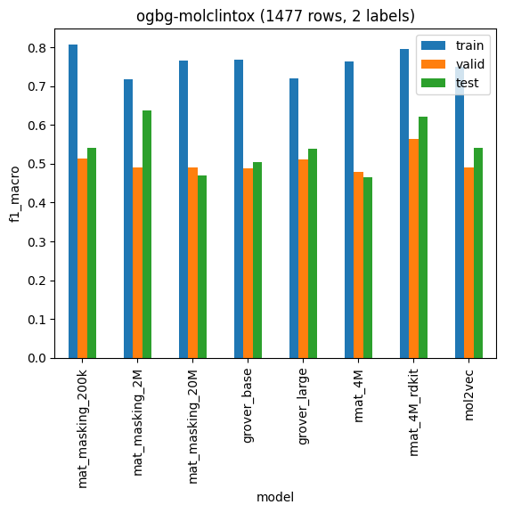
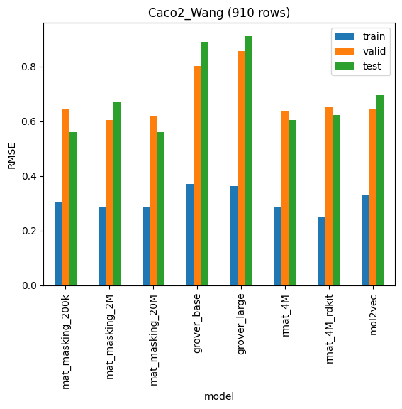
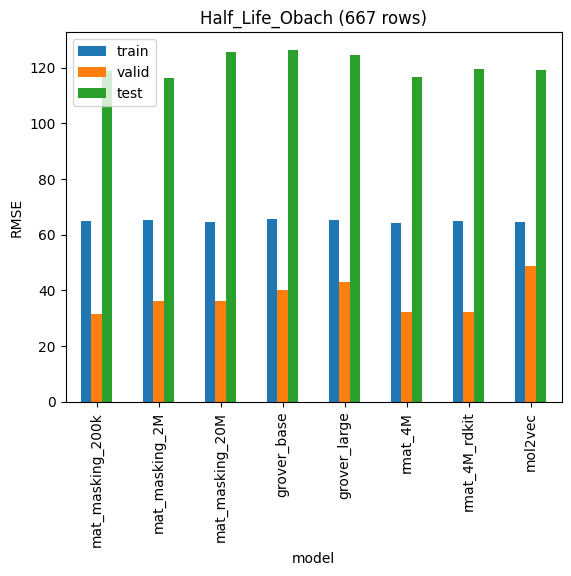

# Decision Tree models

# OGB regression

## ogbg-molesol (1128 rows)

### Decision Tree regression

|                  |       train |   valid |    test |
|:-----------------|------------:|--------:|--------:|
| mat_masking_200k | 5.13221e-17 | 1.57046 | 1.53309 |
| mat_masking_2M   | 7.84175e-18 | 1.42485 | 1.40831 |
| mat_masking_20M  | 5.17199e-17 | 1.38237 | 1.43597 |
| grover_base      | 3.20138e-18 | 2.24354 | 2.49039 |
| grover_large     | 0           | 2.42174 | 2.02254 |
| rmat_4M          | 0           | 1.75896 | 1.60051 |
| rmat_4M_rdkit    | 3.20138e-18 | 1.24906 | 1.21108 |
| mol2vec          | 0.0242687   | 1.90297 | 1.92862 |

### Linear regression

|                  |       train |     valid |      test |
|:-----------------|------------:|----------:|----------:|
| mat_masking_200k | 0.00698101  |  12.0835  |  16.3164  |
| mat_masking_2M   | 0.00669632  |  10.6559  |  10.608   |
| mat_masking_20M  | 0.0110913   |  11.0957  |  11.6254  |
| grover_base      | 4.84409e-05 |   2.16324 |   2.08121 |
| grover_large     | 2.9522e-05  |   1.9734  |   1.93066 |
| rmat_4M          | 0.000379213 | 273.401   | 332.63    |
| rmat_4M_rdkit    | 0.00145986  |   1.6469  |   1.66789 |
| mol2vec          | 0.498069    |   2.15405 |   2.2177  |

## ogbg-molfreesolv (642 rows)

### Decision Tree regression

|                  |     train |   valid |    test |
|:-----------------|----------:|--------:|--------:|
| mat_masking_200k | 0         | 4.53899 | 4.97936 |
| mat_masking_2M   | 0         | 4.89042 | 3.62452 |
| mat_masking_20M  | 0         | 4.42178 | 3.43673 |
| grover_base      | 0         | 5.5019  | 4.32095 |
| grover_large     | 0         | 5.62995 | 4.68763 |
| rmat_4M          | 0         | 4.57263 | 4.26768 |
| rmat_4M_rdkit    | 0         | 3.93633 | 3.03156 |
| mol2vec          | 0.0159983 | 6.00895 | 5.01493 |

### Linear regression

|                  |       train |      valid |       test |
|:-----------------|------------:|-----------:|-----------:|
| mat_masking_200k | 0.00221332  |   10.1227  |   10.9091  |
| mat_masking_2M   | 0.00136263  |    7.71911 |   11.7169  |
| mat_masking_20M  | 0.00130776  |    5.61877 |    8.7636  |
| grover_base      | 2.89642e-05 |    5.01787 |    4.14707 |
| grover_large     | 1.55214e-05 |    4.14497 |    3.55923 |
| rmat_4M          | 1.53808e-05 |    3.43338 |    2.67121 |
| rmat_4M_rdkit    | 1.09142e-05 |    3.79793 |    2.9608  |
| mol2vec          | 0.33686     | 2735.08    | 4921.13    |

## ogbg-mollipo (4200 rows)

### Decision Tree regression

|                  |       train |   valid |    test |
|:-----------------|------------:|--------:|--------:|
| mat_masking_200k | 2.65394e-17 | 1.30252 | 1.29693 |
| mat_masking_2M   | 2.3222e-17  | 1.33647 | 1.28775 |
| mat_masking_20M  | 3.31743e-17 | 1.32512 | 1.23079 |
| grover_base      | 2.29838e-17 | 1.6663  | 1.65298 |
| grover_large     | 1.87662e-17 | 1.58941 | 1.59949 |
| rmat_4M          | 1.87845e-17 | 1.36085 | 1.27359 |
| rmat_4M_rdkit    | 2.98568e-17 | 1.19058 | 1.13538 |
| mol2vec          | 0.0251507   | 1.40683 | 1.34247 |

### Linear regression

|                  |     train |    valid |     test |
|:-----------------|----------:|---------:|---------:|
| mat_masking_200k | 0.459235  | 0.8869   | 0.922497 |
| mat_masking_2M   | 0.459562  | 0.852463 | 0.860197 |
| mat_masking_20M  | 0.458266  | 1.06974  | 0.911371 |
| grover_base      | 0.61604   | 1.25516  | 1.3509   |
| grover_large     | 0.425739  | 1.74478  | 1.66922  |
| rmat_4M          | 0.111604  | 2.35853  | 2.3288   |
| rmat_4M_rdkit    | 0.0637007 | 4.20537  | 3.92791  |
| mol2vec          | 0.703022  | 0.863039 | 0.917748 |

# OGB classification

## ogbg-molbace (1513 rows, 1 labels)

### Decision Tree classifier

|                  |    train |    valid |     test |
|:-----------------|---------:|---------:|---------:|
| mat_masking_200k | 1        | 0.44748  | 0.573188 |
| mat_masking_2M   | 1        | 0.50089  | 0.648746 |
| mat_masking_20M  | 1        | 0.44748  | 0.572022 |
| grover_base      | 1        | 0.384131 | 0.50071  |
| grover_large     | 1        | 0.350092 | 0.530436 |
| rmat_4M          | 1        | 0.423444 | 0.551215 |
| rmat_4M_rdkit    | 1        | 0.467059 | 0.616762 |
| mol2vec          | 0.993074 | 0.480785 | 0.508483 |

### Linear classifier

|                  |    train |    valid |     test |
|:-----------------|---------:|---------:|---------:|
| mat_masking_200k | 0.831908 | 0.496056 | 0.587394 |
| mat_masking_2M   | 0.830118 | 0.491683 | 0.581267 |
| mat_masking_20M  | 0.820305 | 0.525157 | 0.598323 |
| grover_base      | 0.914895 | 0.422266 | 0.515651 |
| grover_large     | 0.962944 | 0.431249 | 0.55814  |
| rmat_4M          | 0.974991 | 0.613181 | 0.617703 |
| rmat_4M_rdkit    | 0.982734 | 0.533369 | 0.627451 |
| mol2vec          | 0.863599 | 0.465514 | 0.55942  |

## ogbg-molbbbp (2039 rows, 1 labels)

### Decision Tree classifier

|                  |    train |    valid |     test |
|:-----------------|---------:|---------:|---------:|
| mat_masking_200k | 1        | 0.647059 | 0.550243 |
| mat_masking_2M   | 1        | 0.782621 | 0.580247 |
| mat_masking_20M  | 1        | 0.710443 | 0.548886 |
| grover_base      | 1        | 0.610037 | 0.488997 |
| grover_large     | 1        | 0.596887 | 0.463689 |
| rmat_4M          | 1        | 0.812844 | 0.598992 |
| rmat_4M_rdkit    | 1        | 0.779152 | 0.59938  |
| mol2vec          | 0.998865 | 0.764615 | 0.535529 |

### Linear classifier

|                  |    train |    valid |     test |
|:-----------------|---------:|---------:|---------:|
| mat_masking_200k | 0.862818 | 0.88041  | 0.588837 |
| mat_masking_2M   | 0.878793 | 0.880969 | 0.553186 |
| mat_masking_20M  | 0.825944 | 0.895733 | 0.518437 |
| grover_base      | 0.986187 | 0.676471 | 0.521535 |
| grover_large     | 0.997719 | 0.686244 | 0.529508 |
| rmat_4M          | 0.993137 | 0.860479 | 0.597386 |
| rmat_4M_rdkit    | 0.991955 | 0.850513 | 0.60364  |
| mol2vec          | 0.904577 | 0.793622 | 0.535529 |

## ogbg-molclintox (1477 rows, 2 labels)

### Decision Tree classifier

|                  |    train |    valid |     test |
|:-----------------|---------:|---------:|---------:|
| mat_masking_200k | 1        | 0.51501  | 0.564667 |
| mat_masking_2M   | 1        | 0.593381 | 0.545796 |
| mat_masking_20M  | 1        | 0.475177 | 0.465704 |
| grover_base      | 1        | 0.47331  | 0.491209 |
| grover_large     | 1        | 0.477032 | 0.519749 |
| rmat_4M          | 1        | 0.593505 | 0.465704 |
| rmat_4M_rdkit    | 1        | 0.527632 | 0.607802 |
| mol2vec          | 0.997155 | 0.509182 | 0.465704 |

### Linear classifier

|                  |    train |    valid |     test |
|:-----------------|---------:|---------:|---------:|
| mat_masking_200k | 0.726896 | 0.715278 | 0.692541 |
| mat_masking_2M   | 0.785726 | 0.616349 | 0.733755 |
| mat_masking_20M  | 0.690613 | 0.616349 | 0.692541 |
| grover_base      | 1        | 0.551994 | 0.530688 |
| grover_large     | 1        | 0.626956 | 0.564392 |
| rmat_4M          | 0.982909 | 0.739437 | 0.785714 |
| rmat_4M_rdkit    | 0.985865 | 0.824561 | 0.746584 |
| mol2vec          | 0.902282 | 0.557488 | 0.64916  |

## ogbg-molsider (1427 rows, 27 labels)

### Decision Tree classifier

|                  |    train |    valid |     test |
|:-----------------|---------:|---------:|---------:|
| mat_masking_200k | 0.996201 | 0.622559 | 0.583275 |
| mat_masking_2M   | 0.996201 | 0.624116 | 0.60169  |
| mat_masking_20M  | 0.996201 | 0.645817 | 0.587667 |
| grover_base      | 1        | 0.612253 | 0.588142 |
| grover_large     | 1        | 0.604206 | 0.578662 |
| rmat_4M          | 0.996201 | 0.615911 | 0.600865 |
| rmat_4M_rdkit    | 1        | 0.622301 | 0.569106 |
| mol2vec          | 0.996875 | 0.631073 | 0.618768 |

### Linear classifier

|                  |    train |    valid |     test |
|:-----------------|---------:|---------:|---------:|
| mat_masking_200k | 0.711525 | 0.669009 | 0.633568 |
| mat_masking_2M   | 0.726685 | 0.675137 | 0.642338 |
| mat_masking_20M  | 0.691487 | 0.680637 | 0.652373 |
| grover_base      | 0.947307 | 0.603832 | 0.600077 |
| grover_large     | 0.987174 | 0.616433 | 0.605663 |
| rmat_4M          | 0.989147 | 0.649001 | 0.620353 |
| rmat_4M_rdkit    | 0.990047 | 0.640349 | 0.613989 |
| mol2vec          | 0.779664 | 0.663695 | 0.638316 |

### ogbg-molclintox (1477 rows, 2 labels)

|                  |    train |    valid |     test |
|:-----------------|---------:|---------:|---------:|
| mat_masking_200k | 0.807393 | 0.512846 | 0.541538 |
| mat_masking_2M   | 0.718334 | 0.489655 | 0.638422 |
| mat_masking_20M  | 0.764696 | 0.489655 | 0.469534 |
| grover_base      | 0.767503 | 0.487889 | 0.503916 |
| grover_large     | 0.720597 | 0.51219  | 0.537565 |
| rmat_4M          | 0.764599 | 0.478873 | 0.465704 |
| rmat_4M_rdkit    | 0.795152 | 0.562778 | 0.621917 |
| mol2vec          | 0.750734 | 0.489655 | 0.541223 |

## TDC regression

### Caco2_Wang (910 rows)

|                  |    train |    valid |     test |
|:-----------------|---------:|---------:|---------:|
| mat_masking_200k | 0.302769 | 0.646621 | 0.561895 |
| mat_masking_2M   | 0.284768 | 0.605881 | 0.671095 |
| mat_masking_20M  | 0.286184 | 0.61923  | 0.559738 |
| grover_base      | 0.369865 | 0.80102  | 0.891209 |
| grover_large     | 0.363558 | 0.856519 | 0.914341 |
| rmat_4M          | 0.287523 | 0.637201 | 0.604958 |
| rmat_4M_rdkit    | 0.25217  | 0.651793 | 0.622664 |
| mol2vec          | 0.329328 | 0.643605 | 0.695815 |

### Half_Life_Obach (667 rows)

|                  |   train |   valid |    test |
|:-----------------|--------:|--------:|--------:|
| mat_masking_200k | 64.8174 | 31.6668 | 118.911 |
| mat_masking_2M   | 65.2176 | 36.1502 | 116.101 |
| mat_masking_20M  | 64.7244 | 36.2528 | 125.732 |
| grover_base      | 65.7987 | 40.1442 | 126.336 |
| grover_large     | 65.3444 | 42.9133 | 124.66  |
| rmat_4M          | 64.288  | 32.342  | 116.718 |
| rmat_4M_rdkit    | 64.9329 | 32.0677 | 119.605 |
| mol2vec          | 64.6126 | 48.9198 | 119.164 |

## OGB regression

### ogbg-molesol (1128 rows)

|                  |       train |     valid |      test |
|:-----------------|------------:|----------:|----------:|
| mat_masking_200k | 0.00698101  |  12.0835  |  16.3164  |
| mat_masking_2M   | 0.00669632  |  10.6559  |  10.608   |
| mat_masking_20M  | 0.0110913   |  11.0957  |  11.6254  |
| grover_base      | 4.84409e-05 |   2.16324 |   2.08121 |
| grover_large     | 2.9522e-05  |   1.9734  |   1.93066 |
| rmat_4M          | 0.000379213 | 273.401   | 332.63    |
| rmat_4M_rdkit    | 0.00145986  |   1.6469  |   1.66789 |
| mol2vec          | 0.498069    |   2.15405 |   2.2177  |

### ogbg-molfreesolv (642 rows)

|                  |       train |      valid |       test |
|:-----------------|------------:|-----------:|-----------:|
| mat_masking_200k | 0.00221332  |   10.1227  |   10.9091  |
| mat_masking_2M   | 0.00136263  |    7.71911 |   11.7169  |
| mat_masking_20M  | 0.00130776  |    5.61877 |    8.7636  |
| grover_base      | 2.89642e-05 |    5.01787 |    4.14707 |
| grover_large     | 1.55214e-05 |    4.14497 |    3.55923 |
| rmat_4M          | 1.53808e-05 |    3.43338 |    2.67121 |
| rmat_4M_rdkit    | 1.09142e-05 |    3.79793 |    2.9608  |
| mol2vec          | 0.33686     | 2735.08    | 4921.13    |

### ogbg-mollipo (4200 rows)

|                  |     train |    valid |     test |
|:-----------------|----------:|---------:|---------:|
| mat_masking_200k | 0.459235  | 0.8869   | 0.922497 |
| mat_masking_2M   | 0.459562  | 0.852463 | 0.860197 |
| mat_masking_20M  | 0.458266  | 1.06974  | 0.911371 |
| grover_base      | 0.61604   | 1.25516  | 1.3509   |
| grover_large     | 0.425739  | 1.74478  | 1.66922  |
| rmat_4M          | 0.111604  | 2.35853  | 2.3288   |
| rmat_4M_rdkit    | 0.0637007 | 4.20537  | 3.92791  |
| mol2vec          | 0.703022  | 0.863039 | 0.917748 |

# Decision Tree models

## OGB regression

## ogbg-molesol (1128 rows)

### Decision Tree regression

|                  |       train |   valid |    test |
|:-----------------|------------:|--------:|--------:|
| mat_masking_200k | 5.13221e-17 | 1.57046 | 1.53309 |
| mat_masking_2M   | 7.84175e-18 | 1.42485 | 1.40831 |
| mat_masking_20M  | 5.17199e-17 | 1.38237 | 1.43597 |
| grover_base      | 3.20138e-18 | 2.24354 | 2.49039 |
| grover_large     | 0           | 2.42174 | 2.02254 |
| rmat_4M          | 0           | 1.75896 | 1.60051 |
| rmat_4M_rdkit    | 3.20138e-18 | 1.24906 | 1.21108 |
| mol2vec          | 0.0242687   | 1.90297 | 1.92862 |

### Linear regression

|                  |       train |     valid |      test |
|:-----------------|------------:|----------:|----------:|
| mat_masking_200k | 0.00698101  |  12.0835  |  16.3164  |
| mat_masking_2M   | 0.00669632  |  10.6559  |  10.608   |
| mat_masking_20M  | 0.0110913   |  11.0957  |  11.6254  |
| grover_base      | 4.84409e-05 |   2.16324 |   2.08121 |
| grover_large     | 2.9522e-05  |   1.9734  |   1.93066 |
| rmat_4M          | 0.000379213 | 273.401   | 332.63    |
| rmat_4M_rdkit    | 0.00145986  |   1.6469  |   1.66789 |
| mol2vec          | 0.498069    |   2.15405 |   2.2177  |

## ogbg-molfreesolv (642 rows)

### Decision Tree regression

|                  |     train |   valid |    test |
|:-----------------|----------:|--------:|--------:|
| mat_masking_200k | 0         | 4.53899 | 4.97936 |
| mat_masking_2M   | 0         | 4.89042 | 3.62452 |
| mat_masking_20M  | 0         | 4.42178 | 3.43673 |
| grover_base      | 0         | 5.5019  | 4.32095 |
| grover_large     | 0         | 5.62995 | 4.68763 |
| rmat_4M          | 0         | 4.57263 | 4.26768 |
| rmat_4M_rdkit    | 0         | 3.93633 | 3.03156 |
| mol2vec          | 0.0159983 | 6.00895 | 5.01493 |

### Linear regression

|                  |       train |      valid |       test |
|:-----------------|------------:|-----------:|-----------:|
| mat_masking_200k | 0.00221332  |   10.1227  |   10.9091  |
| mat_masking_2M   | 0.00136263  |    7.71911 |   11.7169  |
| mat_masking_20M  | 0.00130776  |    5.61877 |    8.7636  |
| grover_base      | 2.89642e-05 |    5.01787 |    4.14707 |
| grover_large     | 1.55214e-05 |    4.14497 |    3.55923 |
| rmat_4M          | 1.53808e-05 |    3.43338 |    2.67121 |
| rmat_4M_rdkit    | 1.09142e-05 |    3.79793 |    2.9608  |
| mol2vec          | 0.33686     | 2735.08    | 4921.13    |

## ogbg-mollipo (4200 rows)

### Decision Tree regression

|                  |       train |   valid |    test |
|:-----------------|------------:|--------:|--------:|
| mat_masking_200k | 2.65394e-17 | 1.30252 | 1.29693 |
| mat_masking_2M   | 2.3222e-17  | 1.33647 | 1.28775 |
| mat_masking_20M  | 3.31743e-17 | 1.32512 | 1.23079 |
| grover_base      | 2.29838e-17 | 1.6663  | 1.65298 |
| grover_large     | 1.87662e-17 | 1.58941 | 1.59949 |
| rmat_4M          | 1.87845e-17 | 1.36085 | 1.27359 |
| rmat_4M_rdkit    | 2.98568e-17 | 1.19058 | 1.13538 |
| mol2vec          | 0.0251507   | 1.40683 | 1.34247 |

### Linear regression

|                  |     train |    valid |     test |
|:-----------------|----------:|---------:|---------:|
| mat_masking_200k | 0.459235  | 0.8869   | 0.922497 |
| mat_masking_2M   | 0.459562  | 0.852463 | 0.860197 |
| mat_masking_20M  | 0.458266  | 1.06974  | 0.911371 |
| grover_base      | 0.61604   | 1.25516  | 1.3509   |
| grover_large     | 0.425739  | 1.74478  | 1.66922  |
| rmat_4M          | 0.111604  | 2.35853  | 2.3288   |
| rmat_4M_rdkit    | 0.0637007 | 4.20537  | 3.92791  |
| mol2vec          | 0.703022  | 0.863039 | 0.917748 |

# OGB classification

## ogbg-molbace (1513 rows, 1 labels)

### Decision Tree classifier

|                  |    train |    valid |     test |
|:-----------------|---------:|---------:|---------:|
| mat_masking_200k | 1        | 0.44748  | 0.573188 |
| mat_masking_2M   | 1        | 0.50089  | 0.648746 |
| mat_masking_20M  | 1        | 0.44748  | 0.572022 |
| grover_base      | 1        | 0.384131 | 0.50071  |
| grover_large     | 1        | 0.350092 | 0.530436 |
| rmat_4M          | 1        | 0.423444 | 0.551215 |
| rmat_4M_rdkit    | 1        | 0.467059 | 0.616762 |
| mol2vec          | 0.993074 | 0.480785 | 0.508483 |

### Linear classifier

|                  |    train |    valid |     test |
|:-----------------|---------:|---------:|---------:|
| mat_masking_200k | 0.831908 | 0.496056 | 0.587394 |
| mat_masking_2M   | 0.830118 | 0.491683 | 0.581267 |
| mat_masking_20M  | 0.820305 | 0.525157 | 0.598323 |
| grover_base      | 0.914895 | 0.422266 | 0.515651 |
| grover_large     | 0.962944 | 0.431249 | 0.55814  |
| rmat_4M          | 0.974991 | 0.613181 | 0.617703 |
| rmat_4M_rdkit    | 0.982734 | 0.533369 | 0.627451 |
| mol2vec          | 0.863599 | 0.465514 | 0.55942  |

## ogbg-molbbbp (2039 rows, 1 labels)

### Decision Tree classifier

|                  |    train |    valid |     test |
|:-----------------|---------:|---------:|---------:|
| mat_masking_200k | 1        | 0.647059 | 0.550243 |
| mat_masking_2M   | 1        | 0.782621 | 0.580247 |
| mat_masking_20M  | 1        | 0.710443 | 0.548886 |
| grover_base      | 1        | 0.610037 | 0.488997 |
| grover_large     | 1        | 0.596887 | 0.463689 |
| rmat_4M          | 1        | 0.812844 | 0.598992 |
| rmat_4M_rdkit    | 1        | 0.779152 | 0.59938  |
| mol2vec          | 0.998865 | 0.764615 | 0.535529 |

### Linear classifier

|                  |    train |    valid |     test |
|:-----------------|---------:|---------:|---------:|
| mat_masking_200k | 0.862818 | 0.88041  | 0.588837 |
| mat_masking_2M   | 0.878793 | 0.880969 | 0.553186 |
| mat_masking_20M  | 0.825944 | 0.895733 | 0.518437 |
| grover_base      | 0.986187 | 0.676471 | 0.521535 |
| grover_large     | 0.997719 | 0.686244 | 0.529508 |
| rmat_4M          | 0.993137 | 0.860479 | 0.597386 |
| rmat_4M_rdkit    | 0.991955 | 0.850513 | 0.60364  |
| mol2vec          | 0.904577 | 0.793622 | 0.535529 |

## ogbg-molclintox (1477 rows, 2 labels)

### Decision Tree classifier

|                  |    train |    valid |     test |
|:-----------------|---------:|---------:|---------:|
| mat_masking_200k | 1        | 0.51501  | 0.564667 |
| mat_masking_2M   | 1        | 0.593381 | 0.545796 |
| mat_masking_20M  | 1        | 0.475177 | 0.465704 |
| grover_base      | 1        | 0.47331  | 0.491209 |
| grover_large     | 1        | 0.477032 | 0.519749 |
| rmat_4M          | 1        | 0.593505 | 0.465704 |
| rmat_4M_rdkit    | 1        | 0.527632 | 0.607802 |
| mol2vec          | 0.997155 | 0.509182 | 0.465704 |

### Linear classifier

|                  |    train |    valid |     test |
|:-----------------|---------:|---------:|---------:|
| mat_masking_200k | 0.726896 | 0.715278 | 0.692541 |
| mat_masking_2M   | 0.785726 | 0.616349 | 0.733755 |
| mat_masking_20M  | 0.690613 | 0.616349 | 0.692541 |
| grover_base      | 1        | 0.551994 | 0.530688 |
| grover_large     | 1        | 0.626956 | 0.564392 |
| rmat_4M          | 0.982909 | 0.739437 | 0.785714 |
| rmat_4M_rdkit    | 0.985865 | 0.824561 | 0.746584 |
| mol2vec          | 0.902282 | 0.557488 | 0.64916  |

## ogbg-molsider (1427 rows, 27 labels)

### Decision Tree classifier

|                  |    train |    valid |     test |
|:-----------------|---------:|---------:|---------:|
| mat_masking_200k | 0.996201 | 0.622559 | 0.583275 |
| mat_masking_2M   | 0.996201 | 0.624116 | 0.60169  |
| mat_masking_20M  | 0.996201 | 0.645817 | 0.587667 |
| grover_base      | 1        | 0.612253 | 0.588142 |
| grover_large     | 1        | 0.604206 | 0.578662 |
| rmat_4M          | 0.996201 | 0.615911 | 0.600865 |
| rmat_4M_rdkit    | 1        | 0.622301 | 0.569106 |
| mol2vec          | 0.996875 | 0.631073 | 0.618768 |

### Linear classifier

|                  |    train |    valid |     test |
|:-----------------|---------:|---------:|---------:|
| mat_masking_200k | 0.711525 | 0.669009 | 0.633568 |
| mat_masking_2M   | 0.726685 | 0.675137 | 0.642338 |
| mat_masking_20M  | 0.691487 | 0.680637 | 0.652373 |
| grover_base      | 0.947307 | 0.603832 | 0.600077 |
| grover_large     | 0.987174 | 0.616433 | 0.605663 |
| rmat_4M          | 0.989147 | 0.649001 | 0.620353 |
| rmat_4M_rdkit    | 0.990047 | 0.640349 | 0.613989 |
| mol2vec          | 0.779664 | 0.663695 | 0.638316 |

